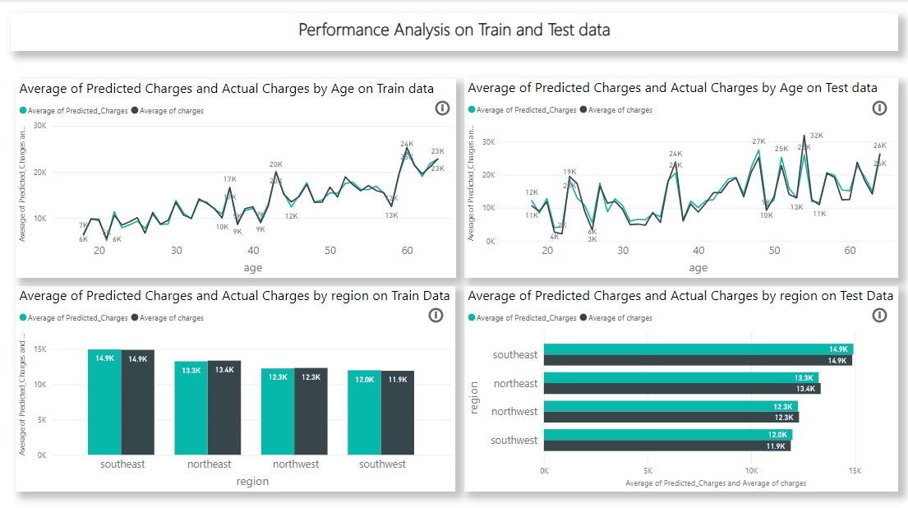
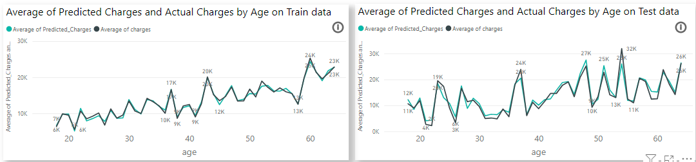
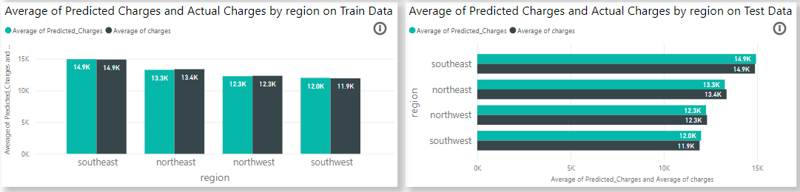

# AutoML Cashflow Optimization for Insurance Company 🚀

This project aims to optimize the prediction of insurance charges using automated machine learning (AutoML). By evaluating multiple machine learning models, this project identifies the most effective algorithms for predicting insurance charges based on customer demographics and regional data.

## Project Overview 📊

The project utilizes a variety of machine learning models to predict insurance charges. The models are rigorously evaluated based on several performance metrics, including R2 Score, Mean Absolute Error (MAE), Mean Squared Error (MSE), and Root Mean Squared Error (RMSE). The analysis includes visual representations of model performance and comparisons between predicted and actual values on both training and test datasets.

### Key Features

- **Model Evaluation and Selection**: 
  - The project evaluates a wide range of models, including Gradient Boosting Regressor, Random Forest Regressor, Lasso Regression, and others. 
  - Models are compared using key metrics like R2 score, MAE, and MSE to identify the top performers.

- **Performance Visualization**:
  - Detailed charts and graphs provide a visual comparison of the predicted versus actual charges across different models.
  - Performance analysis is broken down by demographic variables such as age and region, offering insights into how different models perform across different customer segments.

## Model Performance Summary 🔍

In the model comparison, Gradient Boosting Regressor emerged as the best-performing model with the following metrics:

- **R2 Score**: 83.20%
- **Mean Absolute Error (MAE)**: 2,701.99
- **Mean Squared Error (MSE)**: 23,548,981.36
- **Root Mean Squared Error (RMSE)**: 4,832.97
- **Training Time (TT)**: 0.04 seconds

The chart above presents a comparative analysis of various models based on the R2 score, highlighting the superiority of the Gradient Boosting Regressor.

## Performance Analysis on Train and Test Data 📈

The project provides a detailed performance analysis of the model predictions on both the training and test datasets. This includes an examination of how the models' predictions align with the actual charges based on age and region.

### Age-based Analysis

The charts below display the comparison of predicted and actual charges across different age groups on both training and test data.

These visualizations reveal how well the models perform in predicting insurance charges for different age demographics, indicating where the model predictions are more or less accurate.

### Region-based Analysis

In addition to age, the project analyzes model performance across different geographic regions, providing insights into how location impacts insurance charges.

The bar charts above illustrate the predicted versus actual charges for different regions, showing the consistency and accuracy of the models in different geographical areas.

## Conclusion 🏁

This project demonstrates the power of AutoML in optimizing complex predictions like insurance charges. By systematically evaluating and comparing multiple models, the project identifies the most effective approaches, providing valuable insights into the factors that influence model performance.

## Contributing 🤝

Contributions are welcome! Whether it's improving the existing models, adding new features, or refining the visualizations, feel free to open an issue or submit a pull request.

## License 📄

This project is licensed under the MIT License. See the `LICENSE` file for more details.
